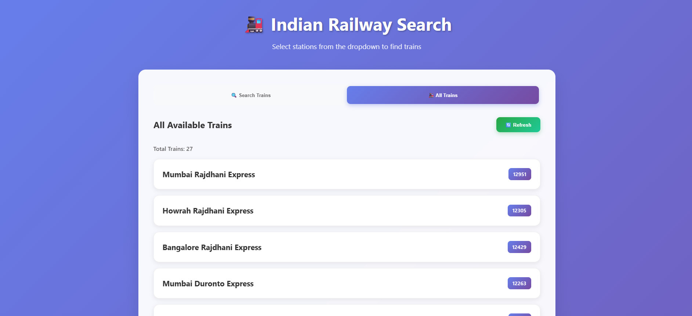
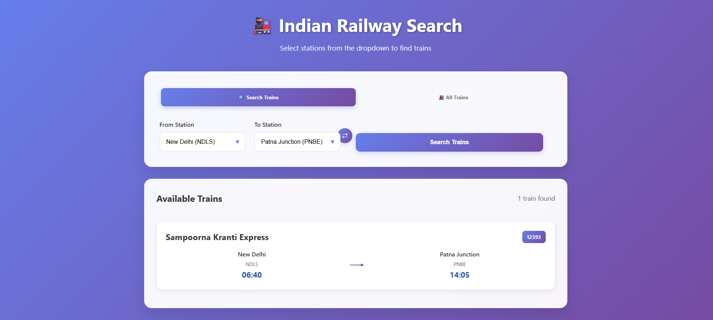

# 🚆 Indian Railway Train Search

A simple web application that allows users to search for trains running between two railway stations. This project is built using **Spring Boot**, **MySQL**, **HTML**, **CSS**, and **JavaScript**.

---

## 🔍 Features

- Search trains by selecting **Source Station** and **Destination Station**
- View available trains along with their **departure time** 
- Responsive and user-friendly interface
- Real-time data fetching from the backend
- Simple and easy-to-understand project for beginners in Spring Boot and web development

---

## 🛠️ Tech Stack

| Layer        | Technology             |
|--------------|------------------------|
| Backend      | Java, Spring Boot      |
| Frontend     | HTML, CSS, JavaScript  |
| Database     | MySQL                  |
| ORM          | Spring Data JPA        |
| Server       | Apache Tomcat (Spring Boot embedded) |

---

## 🧩 Database Schema

The project uses the following database tables:

1. **station** – Stores information about railway stations
2. **train** – Contains train details
3. **trainschedule** – Stores timing and route information for trains

> Sample data is already seeded into the database. You can extend it as per your requirement.

---

## 🚀 How to Run the Project

1. **Clone the Repository**
   ```bash
   https://github.com/uddhav19/Train_search_Project.git
   cd Train_search_Project


## 📸 Screenshots

### 🔎 Homepage


### 📃 Search Results


